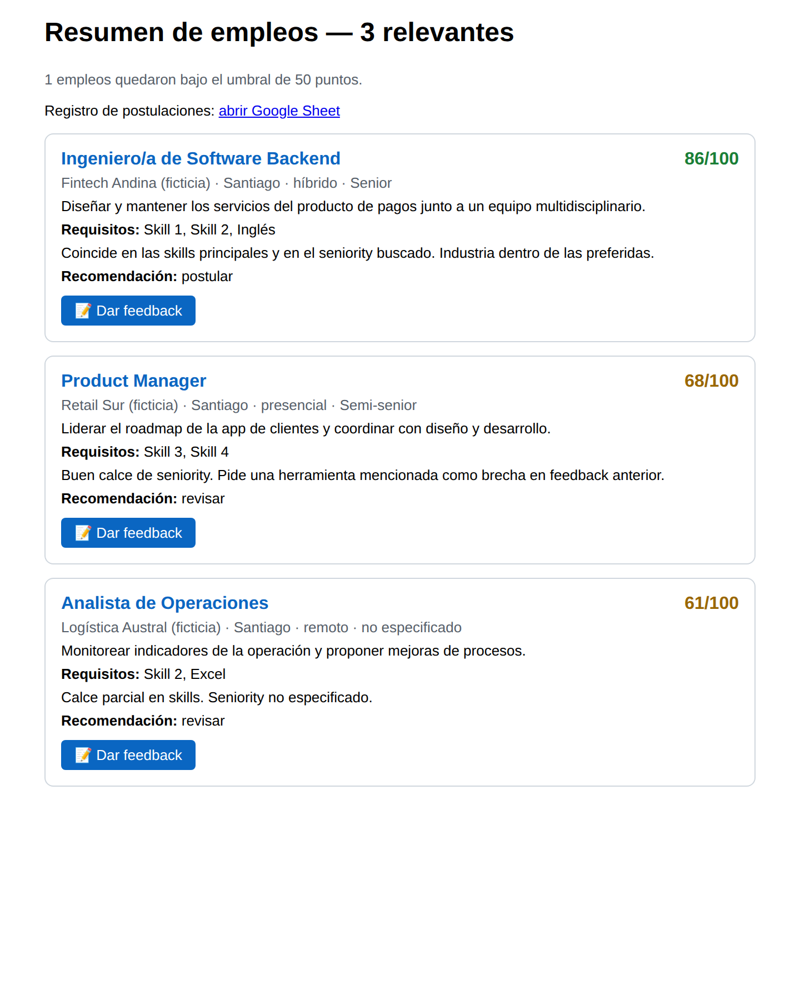
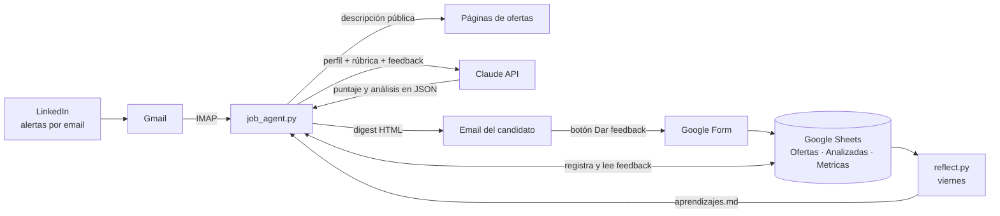

# Agente IA de búsqueda de empleo

Agente que lee las alertas de empleo de LinkedIn, evalúa cada oferta con Claude contra un perfil profesional y envía cada mañana un resumen ordenado por afinidad. Aprende del feedback del candidato: registra a qué ofertas postuló, en qué estado quedaron y qué faltó, y usa ese historial para puntuar mejor las ofertas siguientes.

Corre solo, sin servidores, con GitHub Actions.


> **English summary:** An LLM-powered job-search agent. It reads LinkedIn job alerts from Gmail, scores each posting against a candidate profile with Claude, emails a ranked daily digest, and closes the loop with a feedback system (Google Forms + Sheets) plus a weekly self-review that feeds lessons back into the scoring prompt. Fully serverless on GitHub Actions.

<p align="center"></p>
<p align="center"><sub>Ejemplo del digest diario con datos ficticios.</sub></p>

## Qué hace

- **Lee las alertas de LinkedIn** desde Gmail (IMAP) y descarga la descripción pública de cada oferta, sin iniciar sesión en LinkedIn.
- **Evalúa cada oferta con Claude** usando una rúbrica con pesos configurables: skills técnicos, seniority, modalidad/ubicación e industria. Respeta condiciones de descarte (por ejemplo, cargos trainee).
- **Envía un digest diario** con las ofertas sobre el umbral: resumen del rol, requisitos clave, justificación del puntaje y recomendación (postular, revisar o descartar).
- **Recoge feedback en un clic**: cada oferta trae un botón que abre un Google Form con la oferta ya identificada. Se responde en segundos desde el celular.
- **Aprende con el tiempo**: el feedback se incorpora al prompt de evaluación, y cada viernes una reflexión automática analiza patrones (dónde avanza el candidato, qué brechas se repiten, qué criterio del puntaje está fallando) y propone ajustes a la configuración.
- **Mide todo** en Google Sheets: cada oferta analizada (califique o no) y una fila de métricas por ejecución con volumen, puntajes, tokens y costo.

## Resultados

En las primeras dos semanas de uso real:

| Métrica | Valor |
|---|---|
| Ofertas analizadas | 231 |
| Ofertas que superaron el umbral | 122 (53%) |
| Respuestas de feedback registradas | 24 |

La primera reflexión semanal detectó que la ubicación pesaba más en las decisiones del candidato de lo que reflejaba la rúbrica, y que la mayoría de sus postulaciones se concentraba en industrias que no estaban marcadas como preferidas. Ambos ajustes se aplicaron a la configuración.

## Arquitectura



Todo corre en GitHub Actions:

| Workflow | Cuándo | Qué hace |
|---|---|---|
| `daily.yml` | Lunes a viernes, 08:17 (con dos horarios de respaldo) | Lee alertas, evalúa, envía el digest y registra en Sheets |
| `weekly.yml` | Viernes, 18:00 | Analiza el feedback de la semana y actualiza `aprendizajes.md` |

## Ciclo de mejora continua

1. **Digest:** cada oferta llega con un puntaje y un botón de feedback.
2. **Feedback:** el candidato marca si postuló, el estado del proceso y qué faltó o qué no le gustó.
3. **Contexto:** en la siguiente ejecución, ese historial se agrega al prompt. Claude sube el puntaje de ofertas parecidas a las que interesaron, lo baja en las parecidas a las descartadas y advierte brechas que antes causaron rechazos.
4. **Reflexión semanal:** con al menos 8 respuestas, Claude analiza patrones y escribe `aprendizajes.md` con hallazgos y cambios sugeridos a `config.json`. Los cambios a la configuración nunca se aplican solos: el candidato decide.

## Decisiones técnicas

- **Sin scraping de LinkedIn.** LinkedIn hace la búsqueda con sus filtros nativos y el agente solo lee el correo del candidato y páginas públicas, con pausas entre peticiones. Es más estable y respeta los términos de uso.
- **Búsqueda por fecha, no por "no leído".** Al principio se procesaban solo alertas no leídas, y abrir una alerta en el celular hacía que el agente la saltara. Ahora busca las alertas de los últimos días y `seen_jobs.json` evita repetir ofertas.
- **Resistente a respuestas imperfectas del modelo.** Cada respuesta de Claude se normaliza: si falta un campo o el puntaje viene como texto, se completa en vez de detener el digest.
- **Robusto frente a atrasos de GitHub Actions.** Las ejecuciones programadas de GitHub pueden atrasarse horas o saltarse. El workflow corre en tres horarios con `concurrency`, y gracias a la deduplicación las ejecuciones de respaldo no envían correos repetidos.
- **Estado consistente.** `seen_jobs.json` se actualiza y los correos se marcan como leídos solo después de enviar el digest, así una falla a mitad de camino no pierde ofertas.
- **Integraciones opcionales.** Si Google Sheets no responde, el digest se envía igual; el feedback y las métricas nunca bloquean el flujo principal.
- **Procesamiento por lotes.** Las ofertas se evalúan en lotes de 10 para no exceder el límite de tokens por respuesta.

## Stack

Python 3.12 · Claude API (Anthropic) · Gmail IMAP/SMTP · BeautifulSoup · Google Sheets API (gspread) · Google Forms · GitHub Actions

## Puesta en marcha

La guía completa, paso a paso, está en **[docs/CONFIGURACION.md](docs/CONFIGURACION.md)**. En resumen:

1. Crea alertas de empleo diarias en LinkedIn con notificación por email.
2. Crea un repositorio **privado** a partir de este y copia `config.example.json` como `config.json` con tu perfil.
3. Genera una contraseña de aplicación de Gmail y una API key de Anthropic.
4. *(Opcional, para feedback y métricas)* Crea una cuenta de servicio de Google, un Google Sheet y un Google Form.
5. Agrega los secrets en GitHub y ejecuta el workflow con **Run workflow**.

> Usa un repositorio privado para tu instancia: `config.json` contiene tu perfil y tus correos, y los workflows guardan el historial en el repositorio.

## Estructura del repositorio

```
├── job_agent.py            # Agente diario: lee alertas, evalúa con Claude, envía el digest
├── sheets.py               # Integración con Google Sheets/Forms: feedback, historial y métricas
├── reflect.py              # Reflexión semanal: analiza el feedback y escribe aprendizajes.md
├── config.example.json     # Plantilla de configuración (perfil, rúbrica, correo, feedback)
├── requirements.txt
├── .github/workflows/
│   ├── daily.yml           # Digest de lunes a viernes
│   └── weekly.yml          # Reflexión de los viernes
└── docs/
    ├── CONFIGURACION.md    # Guía de instalación y solución de problemas
    └── img/
```

## Costos

Todo usa planes gratuitos, salvo la API de Claude. Con unas 15 ofertas diarias, el costo estimado es del orden de **US$2 a 4 al mes**. La pestaña `Metricas` registra los tokens y el costo real de cada ejecución.

## Próximas mejoras

- Descartar automáticamente las ofertas que LinkedIn marca como cerradas.
- Activar el workflow desde un cron externo para eliminar los atrasos de GitHub Actions.
- Usar *prompt caching* para que el historial de feedback se cobre una sola vez por ejecución.
- Panel en Looker Studio sobre la pestaña `Metricas`.

## Licencia

[MIT](LICENSE).
